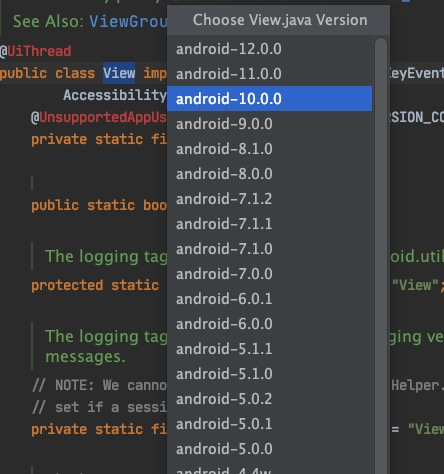
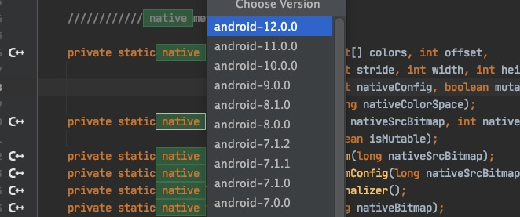
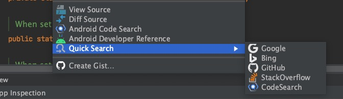

# Android Open Source Reference Plugin

<!-- Plugin description -->
The library inspired by [AndroidSourceViewer](https://github.com/pengwei1024/AndroidSourceViewer)

**It's built with the Gradle and rewritten by kotlin, that's why it's a new repo but not pr.**

**In the rewriting, I have added some features too.**

I found this is a terrible pattern to find the file path from the psi framework after the first commit. I will do more
works to solve the psi problem. Who with relevant practical experience can help me.
<!-- Plugin description end -->

## Install

## Feature

* Download android-AOSP-source from the remote.
    * [github.com/aosp-mirror](https://github.com/aosp-mirror/platform_frameworks_base)
    * [sourcegraph.com](https://sourcegraph.com/)
    * [androidxref.com](http://androidxref.com/)

You download aosp framework files like:

And view native method by click c++ image:

* Quick Android Reference
    * [developer.android.google](https://developer.android.com/reference)

* View Android Source Online
    * [Android Code Search](https://cs.android.com/)

* Quick Search by the mouse right click.
    * google.com
    * bing.com
    * github.com
    * stackoverflow

  

## TODO

More works.

- [ ] androidx support(before next weekend).
- [ ] auto jump to the source line.
- [ ] linker more action in the aosp source.
- [ ] add native jni mapping db.
- [ ] add java class/method mapping db.
- [ ] support custom quick search menu.
- [ ] android reference support two hosts:`developer.android.com`/`developer.android.google.cn`
- [ ] diff android version. many files location is changed.

## License

The project is licensed under the [Apache License 2.0](./LICENSE.txt).
