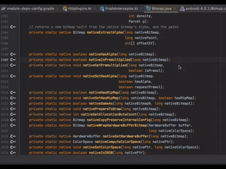
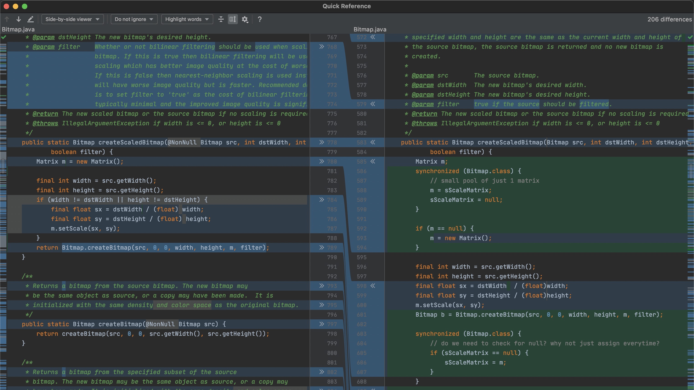
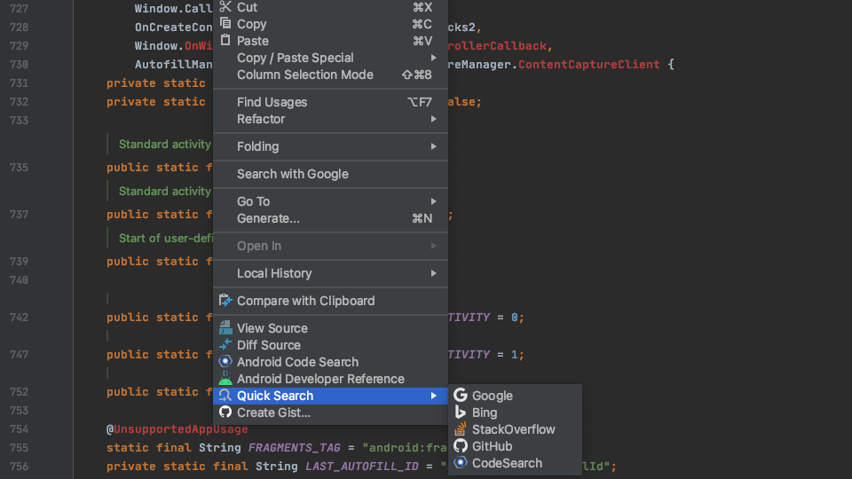
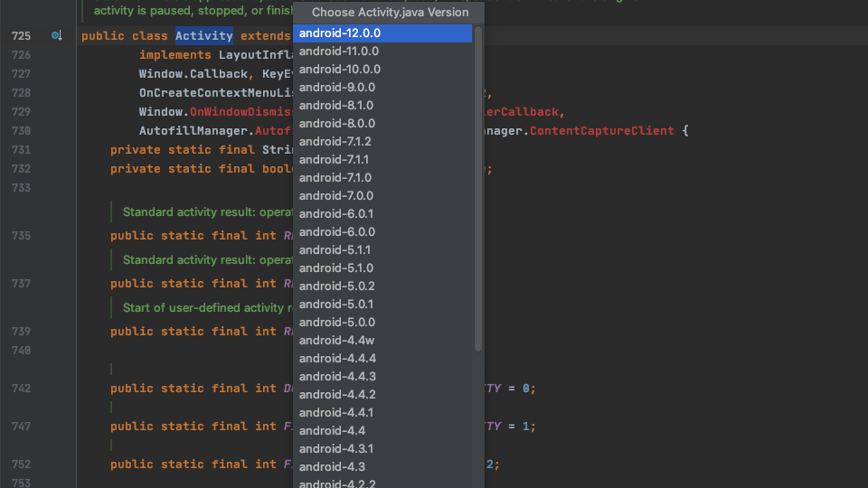
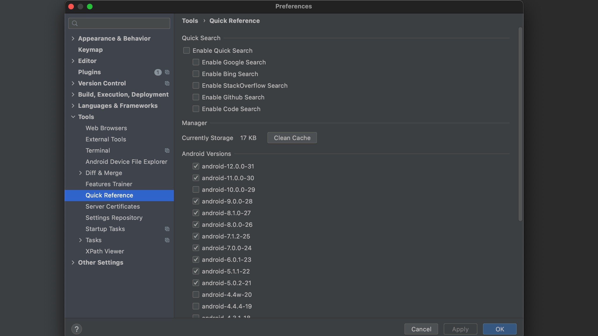

# Android Open Source Reference Plugin

The library inspired by [AndroidSourceViewer](https://github.com/pengwei1024/AndroidSourceViewer)

And written by Kotlin on the JetBrains IDE tha under the opensource license.

**It's built with the Gradle and rewritten by kotlin, that's why it's a new repo but not pr.**

**In the rewriting, I have added some features too.**

<!-- Plugin description -->

* You can view Android Open Source in the ide And link the native method to native code.
* Support Quick Search by google/bing/github/stackoverflow
* Quick Open Android CodeSearch/Dev Reference by the Browser.

I found this is a terrible pattern to find the file path from the psi framework after the first commit. I will do more
works to solve the psi problem. Who with relevant practical experience can help me.
<!-- Plugin description end -->

## Install

[Get Plugin From Market](https://plugins.jetbrains.com/plugin/18369-quick-reference/versions/stable/153417)

## Build

* get lsf files by: git lfs fetch --all
* get the latest aosp git repo and add the path to the environment variable as AOSP_PATH
* run the test code generator the versions/mapping...
* run the build command
* create db by DBGenerator tools.
* ./gradlew runIde

## Publish
* ./gradlew publishPlugin

## Feature

* View native method by click c++ image,but I can't support int native auto jump between dif files
  without `com.intellij.modules.cidr.lang` for c/c++ psi.

* You can compare diff version source.

* Download android-AOSP-source from the raw remote.
    * [android.googlesource.com](https://android.googlesource.com/)
    * [androidxref.com](http://androidxref.com/)

* Quick Android Reference
    * [developer.android.google](https://developer.android.com/reference)

* Quick Search by the mouse right click.
    * google.com
    * bing.com
    * github.com
    * stackoverflow

  
  

* Support Menu.
  

## TODO

More works.

- [x] auto jump to the source line.
- [ ] linker more action in the aosp source.
- [x] add native jni mapping db.
- [x] add java class/method mapping db.
- [x] support custom quick search menu.
- [x] diff android version. many files location is changed.
- [x] support buildSearchableOptions

## File Mapping

The package/filenames is very different.
I create a scripts generate db by load all files.

* [RepoTools](./src/test/java/com/quickref/plugin/git/RepoTools.kt) use for checkout the diff commit ref's native files.
* [NativeDBGenerator](./src/test/java/com/quickref/plugin/db/NativeDBGenerator.kt) native db sql
* [JavaDBGenerator](./src/test/java/com/quickref/plugin/db/JavaDBGenerator.kt) java db sql

## License

The project is licensed under the [Apache License 2.0](./LICENSE.txt).
